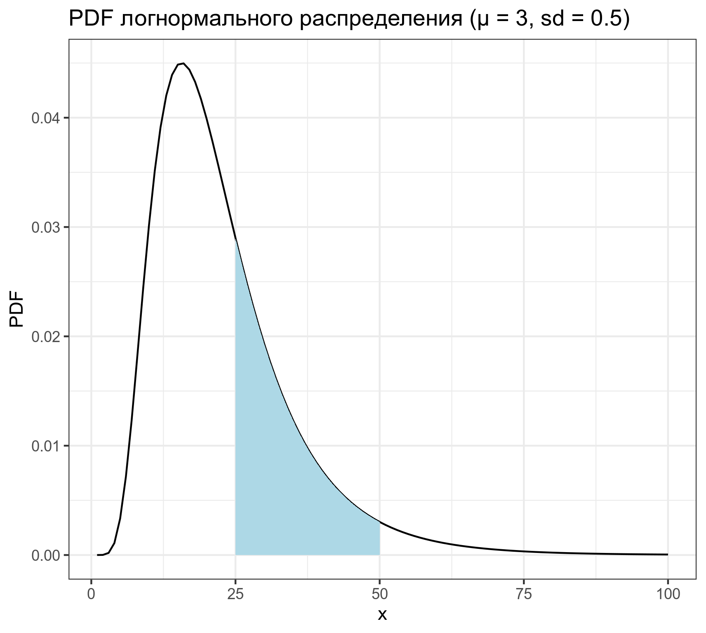
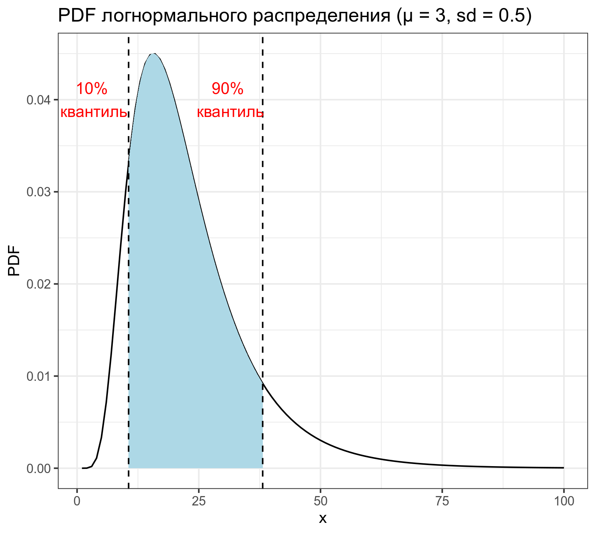

```{r, message=FALSE}
library(tidyverse)
```


## task 1.1
Дан график логнормального распределения со лог-средним 3 и лог-стандартным отклонением 0.5. Используйте функцию `integrate()`, чтобы посчитать закрашенную площадь под кривой. В ответе выведите в консоль значение с точностью до трех знаков после запятой.



```{r}
# Ответ на задание 1.1
```


## task 1.2

Дан график логнормального распределения со лог-средним 3 и лог-стандартным отклонением 0.5. Используйте функцию `integrate()`, чтобы посчитать закрашенную площадь под кривой. В ответе выведите в консоль значение с точностью до трех знаков после запятой.



```{r}
# Ответ на задание 1.2
```
